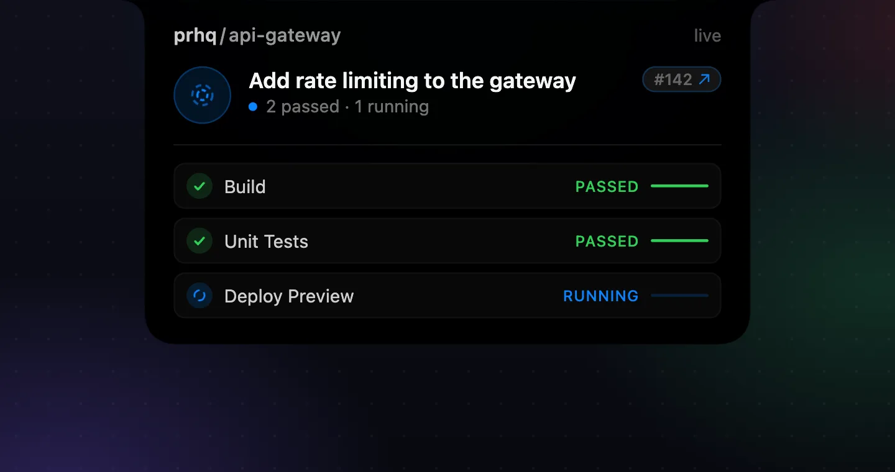

# PRHQ

**Every open PR, live in your notch.**

PRHQ delivers realtime updates from GitHub to your Mac's notch — checks,
reviews, and merges across every open pull request, as they happen.



Learn more at **[prhq.app](https://prhq.app)**.

## Install

**[Download PRHQ.dmg](https://github.com/prhq-app/releases/releases/latest/download/PRHQ.dmg)** — or with Homebrew:

```sh
brew install --cask prhq-app/tap/prhq
```

Requires macOS 26 or later · Apple Silicon · Signed & notarized.

## Support

Bug reports and questions: [open an issue](https://github.com/prhq-app/releases/issues)
in this public repository — issues here are visible to everyone, so leave out
anything private. For private matters, email [support@prhq.app](mailto:support@prhq.app).
